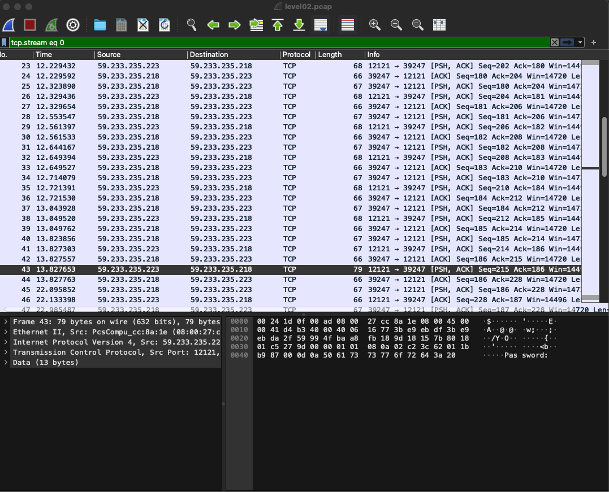
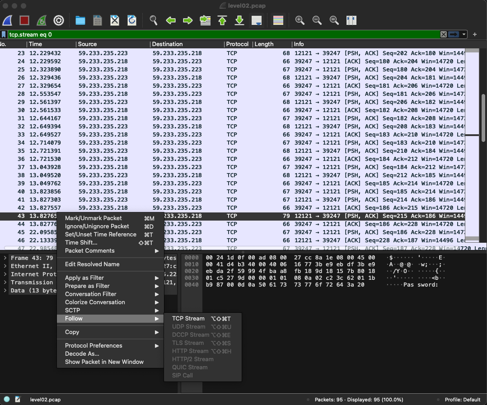
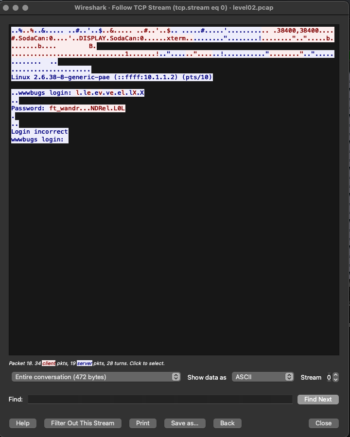

## Level02

Dans ce niveau, vous êtes confronté à un fichier appelé "Level02.pcap". Il s'agit d'un fichier PCAP, également connu sous le nom de fichier de capture de paquets, qui est couramment utilisé pour enregistrer des données de réseau. Les fichiers PCAP contiennent des enregistrements de paquets réseau, ce qui signifie qu'ils capturent et stockent le trafic réseau tel qu'il est transmis sur un réseau, y compris les données, les en-têtes de paquets, les adresses IP, les ports, etc.

## Solution 1

```bash
((tcpdump -A -r level02.pcap | grep -A3 '> 59.233.235.223.12121' | grep -A500 '07:23:34.363418' | grep -A3 'length 1' | grep -v -e 'IP') && echo --) | grep -B1 -e '--' | grep -v -e '--' | grep -o '.$' | tr -d '\n' | cat -e && echo
```

## Solution 2

### Étape 1 : Récupération du fichier "Level02.pcap"
Tout d'abord, vous devez récupérer le fichier "Level02.pcap" depuis la machine distante à l'aide de la commande ```scp```.
```bash
scp -P 4242 level02@<ip>:level02.pcap
```

Assurez-vous que le fichier "Level02.pcap" est accessible en lecture avec la commande suivante :
```bash
chmod x+r ./level02.pcap
```

### Étape 2 : Analyse du fichier PCAP avec Wireshark
Une fois que vous avez le fichier "Level02.pcap" sur votre système local, vous pouvez utiliser Wireshark pour l'analyser. Wireshark est un outil graphique qui vous permet d'examiner les données capturées dans un fichier PCAP. Voici comment procéder :

- Ouvrez Wireshark et ouvrez le fichier "Level02.pcap" à partir de l'interface.

- Dans la fenêtre principale de Wireshark, vous verrez la liste des paquets réseau capturés.

- Pour trouver le mot de passe, recherchez le paquet contenant le mot de passe. Vous pouvez le faire en cherchant une ligne contenant "password".



Une fois que vous avez trouvé le paquet, sélectionnez-le, puis suivez le flux TCP pour voir le contenu texte du paquet.


Vous trouverez le mot de passe recherché, qui est "ft_wandr...NDRel.L0L". Notez que vous devrez supprimer les points pour obtenir le mot de passe complet.



Maintenant, pour obtenir le mot de passe complet, nous allons nettoyer le texte en supprimant tous les caractères '.' (points) se répétant sept fois. De plus, nous supprimerons les trois premiers points et les trois premiers caractères qui précèdent le premier point.

Après cette opération, le mot de passe "ft_wandr...NDRel.L0L" deviendra "ft_waNDReL0L".

Avec le mot de passe obtenu, vous pouvez continuer à résoudre le niveau suivant.

```bash
su flag02
N'oubliez pas de lancer la commande getflag !
```

```bash
Check flag.Here is your token : kooda2puivaav1idi4f57q8iq
```


